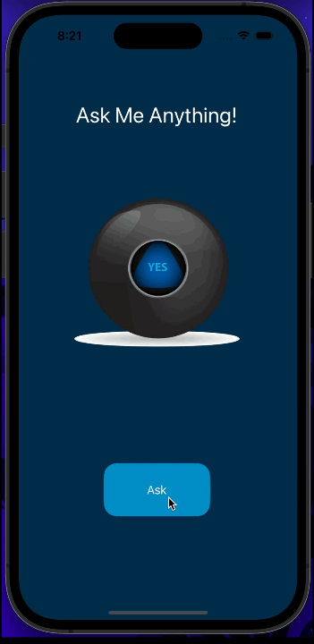
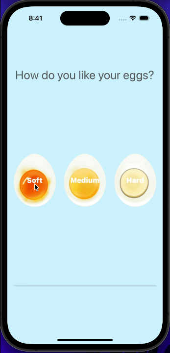
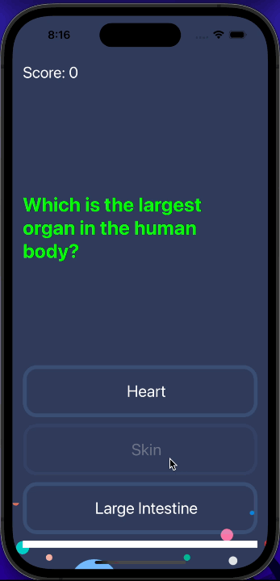
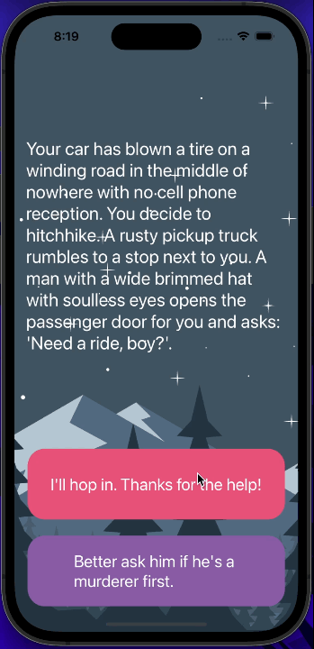

# iOS App Development Bootcamp Projects

This repo contains the apps and challenges I completed while taking "iOS & Swift - The Complete iOS App Development Bootcamp" course by Dr. Angela Yu on Udemy.

## :8ball: Magic 8 Ball

> 

> When the user clicks the ask button, app selects random answer from an array of UIImages and displays it on the ImageView.

## :alarm_clock: Egg Timer

> 

> User chooses one of the three different egg types. There is three different button "Soft" "Medium" and "Hard". All types are stored in dictionary with boiling times. Scheduled timer starts when user clicks one of the buttons. The progress bar starts to fill every second depending on how much time there is left to reach chosen time. When the time is up, alarm will sound. AVFoundation framework is used to play the alarm sound.

## :question: Quizzler

> 

> User tries to find the right answer for every question. There is 3 answer buttons and score counter at the top of the screen. MVC architecture is used. Question model has "text", "answers", and "correctAnswer" properties. Questions are stored in QuizBrain structure, inside an array of Question model instances. QuizBrain model stores current question number and current user score inside "questionNumber" and "score" properties. All required functions are defined inside QuizBrain model. When the user clicks any of the answers, question label text color changes depending on the answer, all buttons are disabled and then timer triggers "updateUI" function after one second. "updateUI" function sets new question text and answer buttons titles. If the user correctly answers the question, score is increased by one.

## Destini

> 

> User selects one of the two options to continue story. Story model has title and two choices with destinations properties. StoryBrain model stores array of Story model instances. "storyNumber" property stores the index of current story and it is stored inside StoryBrain structure. When user clicks any option, "nextStory" method which is defined inside StoryBrain, gets triggered and sets the new story depending on the users choice.